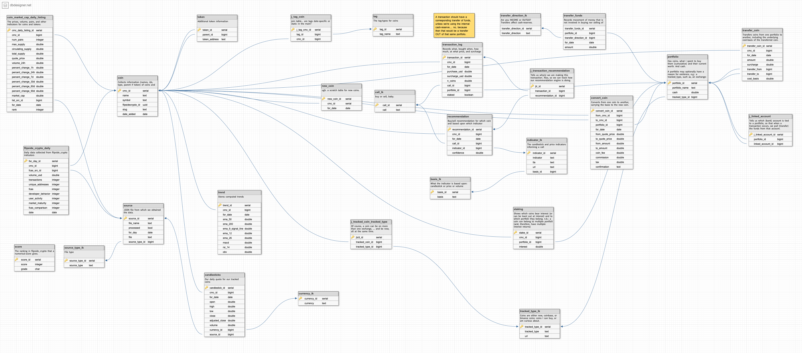

# CoinMarketCap analyzer

Here are the scripts and files for extracting the daily rankings from
coinmarketcap.com and then analyzing those coins.

## Setup

You need the following environmental variables established in order to run
this system:

* `COIN_MARKET_CAP_DIR` pointing to this directory; and,
* `COIN_MARKET_CAP_API_KEY` which you get by requesting an API key from 
coinmarketcap.com

To connect to your SQL database, you'll need the following environmental 
variables:

* `SQL_DAAS_SERVER_URL_ECOIN`
* `SQL_DAAS_DB_NAME_ECOIN`
* `SQL_DAAS_USERNAME_ECOIN`
* `SQL_DAAS_PASSWORD_ECOIN`
* `SQL_DAAS_SERVER_PORT_ECOIN`

## What to do

The script `scripts/report.sh` fetches the latest e-coin rankings, updates
our historical data, then reports on the Top-10 e-coins as well as new coins
today. It also formats a tweet and title for today's report.

The report generates the top-10 e-coins and also the new coins for the day
(state is maintained in rankMatrix). A sample report is here:
http://logicalgraphs.blogspot.com/2021/03/top-10-e-coins-for-2021-03-09.html

## E/R Diagram

TODOs:

* populate candlesticks for tracked coins
* create a daily cadence for updating candlesticks
* download FCAS scores: ... once we have cmc_id-to-flipside_crypto_uuid mapping

OTHER TODOs: 

* create a portfolio: positions held, money invested, current value
* create a transaction history (you know, for tax purposes)

* apply analytics (WHICH ONES? 3 candlesticks is a start) against coins

* get FCAS ids for cmc_id'd coins I want to measure with FCAS
* get FCAS data for monitored coins

* get d3.js tools working, e.g.s:

### d3.js has the following:

* https://observablehq.com/@d3/bollinger-bands
* https://observablehq.com/@d3/candlestick-chart
* https://observablehq.com/@fil/plateau-detection?collection=@fil/interpolation
* https://observablehq.com/@fil/hello-loess?collection=@fil/interpolation
* https://observablehq.com/@fil/gaussian-smoothing

Do we look at all e-coins as Voronoi? or Word-cloud?

* https://observablehq.com/@d3/voronoi-labels
* https://observablehq.com/@d3/word-cloud

... I have examples of running d3 under 
https://github.com/geophf/1HaskellADay/tree/master/exercises/HAD/Graph/D3

## Revision History
### ... or feeping creatures! AHA!

* 2021-03-27: uploaded coinbase and binance tradeable coins to tracked-coins.

* 2021-03-26: Saving Cryptocoin-tags to data-store:
http://logicalgraphs.blogspot.com/2021/03/saving-cryptocoin-tags-to-data-store.html

* 2021-03-23: Shifted from the CoinMarketCap ranking-JSON file to the
more-comprehensive listing-JSON file.

* 2021-03-09: Saving CoinMarketCap JSON files to the data-store:
http://logicalgraphs.blogspot.com/2021/03/progress-report-2021-03-09.html
