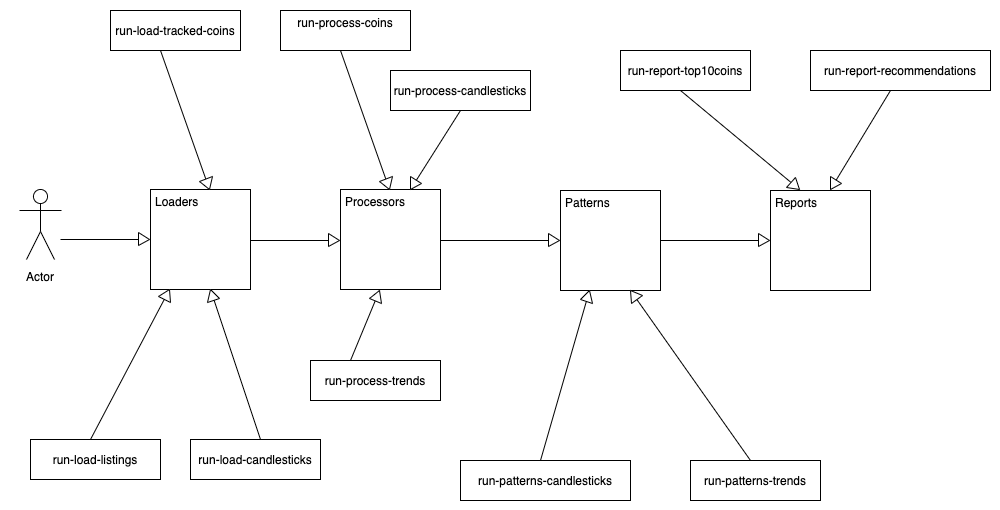

# CoinMarketCap analyzer

Here are the scripts and files for extracting the daily rankings from
coinmarketcap.com and then analyzing those coins.

## Setup

You need the following environmental variables established in order to run
this system:

* `COIN_MARKET_CAP_DIR` pointing to this directory; and,
* `COIN_MARKET_CAP_API_KEY` which you get by requesting an API key from 
coinmarketcap.com

To connect to your SQL database, you'll need the following environmental 
variables:

* `SQL_DAAS_SERVER_URL_ECOIN`
* `SQL_DAAS_DB_NAME_ECOIN`
* `SQL_DAAS_USERNAME_ECOIN`
* `SQL_DAAS_PASSWORD_ECOIN`
* `SQL_DAAS_SERVER_PORT_ECOIN`

## What to do

The script `scripts/report.sh` fetches the latest e-coin rankings, updates
our historical data, then reports on the Top-10 e-coins as well as new coins
today. It also formats a tweet and title for today's report.

The report generates the top-10 e-coins and also the new coins for the day
(state is maintained in rankMatrix). A sample report is here:
http://logicalgraphs.blogspot.com/2021/03/top-10-e-coins-for-2021-03-09.html

## E/R Diagram

### Tools used

* dbdesigner: dbdesigner.net for the ERD
* clever-cloud.com: db hosting

## Architecture
### Recommendation Architecture

The component architecture is straightforward. 

* We have loaders the pull the data from from various sources and then load 
those data to the data-store (data model, above). 
* We have processors that transform the raw (CSV and JSON), stored, data to 
entities and relations.
* We have business logic that runs patterns and detect trends in the stored
entities, then distills the results with recommendations, which are then saved
to the data-store.
* Finally, we generate reports against the entities and the recommendations
in the data store.

### Portfolio Architecture

The portfolio is a little dance between the transactions, the recommendations
associated with the transcations, culminating into a trading portfolio. There
can be multiple portfolii, and I'm thinking one per e-coin exchange. A buy/sell
transaction has an associated set of recommendations that prompted that 
transaction (indexed by the coin transacted). The price and surcharges are
transaction-based (not price-of-the-day for the coin, as the buy/sell price
fluctuates per transaction). The portfolio is the sum of the costs of the 
transactions verses the current values of the holdings.

### Tools used

* umletino: http://www.umlet.com/umletino/umletino.html
* designs archived at src/CryptoCoin/CoinMarketCap/design/

## Patterns

### Candlesticks

First, the [Five Most Powerful Candlestick Patterns](https://www.investopedia.com/articles/active-trading/092315/5-most-powerful-candlestick-patterns.asp), according to [investopedia](https://www.investopedia.com/).

* Three White Knights/Soldiers: https://www.investopedia.com/terms/t/three_white_soldiers.asp
* Three Black Crows: https://www.investopedia.com/terms/t/three_black_crows.asp
* Three Line Strike: https://www.investopedia.com/articles/active-trading/092315/5-most-powerful-candlestick-patterns.asp#three-line-strike
* Abandoned Baby: https://www.investopedia.com/terms/b/bullish-abandoned-baby.asp
* Two Black Gapping: https://www.investopedia.com/articles/active-trading/092315/5-most-powerful-candlestick-patterns.asp#two-black-gapping
* Evening Star: https://www.investopedia.com/articles/active-trading/092315/5-most-powerful-candlestick-patterns.asp#evening-star

### Price and Volume trends

* Simple Moving Average: https://www.investopedia.com/terms/s/sma.asp
* Exponential Moving Average: https://www.investopedia.com/terms/e/ema.asp
* Moving Average Convergence/Diverence: https://www.investopedia.com/terms/m/macd.asp
* On Balance Volume: https://www.investopedia.com/terms/o/onbalancevolume.asp
* Relative Strength Index: https://www.investopedia.com/terms/r/rsi.asp 

## TODOs:

* We need to update coin transfers as fees can be in other coin.

* We need to add loans.

* We need to move holdings to its own data type

* We need a coin exchange from coin to coin, called CoinConvert, that is, when
  we convert COMP to ETH (to MIR)
  * we need to add a data-table for this
  * as well as the ETL process
  * as well as updating how we compute holdings

* We need to know the best (lowest) average price on a BUY recommendation and
  the best (highest) average price on a SELL recommendation... and not $0.00.

* provide year-to-date transaction history with the portfolio report

* we need to analyze the trades vis-à-vis recommendations and find which ones
are effective and which ones aren't, or combinations, or what. ... Bayes?

* true pipeline with jobs starting on the signal of a job's completion.

* represent coins-as-graph

* create a spot-check that runs the numbers on any arbitrary yahoo-symbol

* download FCAS scores: ... once we have cmc_id-to-flipside_crypto_uuid mapping
  * map FCAS coin uuids to cmc_ids

* get FCAS data for monitored coins

* get d3.js tools working, e.g.s:

### d3.js has the following:

* https://observablehq.com/@d3/bollinger-bands
* https://observablehq.com/@d3/candlestick-chart
* https://observablehq.com/@fil/plateau-detection?collection=@fil/interpolation
* https://observablehq.com/@fil/hello-loess?collection=@fil/interpolation
* https://observablehq.com/@fil/gaussian-smoothing

Do we look at all e-coins as Voronoi? or Word-cloud?

* https://observablehq.com/@d3/voronoi-labels
* https://observablehq.com/@d3/word-cloud

... I have examples of running d3 under 
https://github.com/geophf/1HaskellADay/tree/master/exercises/HAD/Graph/D3

## Revision History
### ... or feeping creatures! AHA!

* 2021-07-26: Added buy/sell recommendations to portfolio holdings
* 2021-07-25: transfer coin protocol added to portfolio reports.
* 2021-07-11: transfer_coin table to transfer coins between exchanges.
* 2021-07-10: Day-after reports now also report yesterday's recommended call.
* 2021-07-04: Automated day-after results report
* 2021-06-26: Tracking coins now via cmc_id
* 2021-06-24: Rearranged the ETL (load-part) and prefiltered file before 
  parsing it to JSON
* 2021-06-10: Corrected issue with multiple transactions not being recorded.

... the complete revision history is [here](HISTORY.md)
