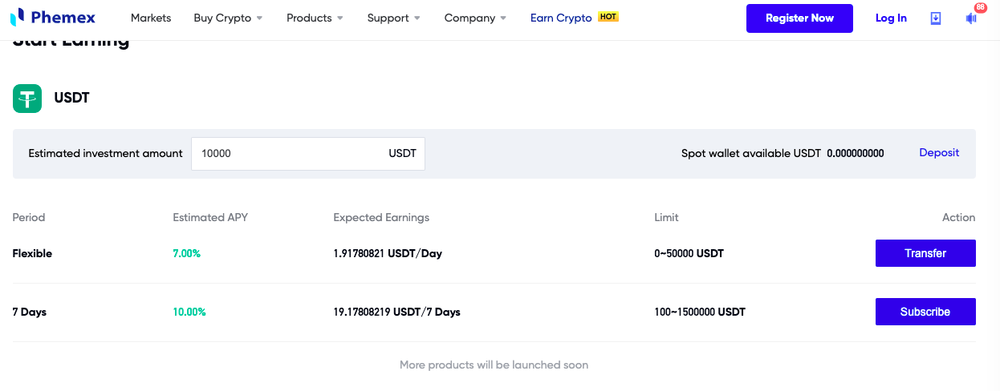

# Staking Cryptocurrency: a way to create revenue from your E-Coins

Did you know that you could 'earn interest' on your cryptocurrencies? And, at a significantly higher interest rate than what you can earn from bank accounts, certificates of deposit (CDs), or bonds?

By staking your e-coins, -- that is to say, loaning out your e-coins at interest -- you can earn money from your cryptocurrency that is rolled back into your staked coins, 'growing' your money over time.

What is 'staking'? How do you do this? Which e-coins can be staked? Let's take a look at how to stake your e-coins.

## What is 'staking'?

Do you know that anybody can loan anybody things? You lend somebody a book, they give it back, ... someday.

You hope.

You can also lend money. Some people think that only banks can lend money, but that's not true (never was), and is particularly not true nowadays with decentralized (crypto)currencies. Your dad can lend you $1000 for a down-payment on a house or car or to start a business, and you and he can have a formal or informal contract. "Dad, I'll pay you back over a year at 5% interest" is a very informal contract. Getting a loan from a bank or a mortgage company is a much more formal process, but follows the same contract: "I agree to pay back this loan of money on my house over the next 30 years at 3.375% interest. ... [with a lot more words thrown in there for good measure]." So, usually we think of 'loan accounts' (also called 'loans' or 'mortgages' (a loan you pay off until you die ('mort' means 'death' that you (en)gage in)) as something belonging to a bank.

Now, with decentralized currencies, anybody who owns e-coins can loan them out, and even loan them out at interest that begins accruing, sometimes immediately on owning these coins.

... But how do you stake your cryptocurrencies?

Besides having the complete freedom to loan out your e-coins to anyone (who, if they have a wallet, makes loaning them the e-coin easy to do and traceable), there are formal ways that exchanges permit you to stake your e-coins. Each exchange handles staking similarly, but each has their own particularities, so I will review four exchanges and how they allow to you stake certain e-coins.

### CoinBase

With CoinBase, staking is automatic when you purchase the following coins into your coinbase wallet: $USDC at 0.15% (you read that correctly), $DAI at 2%, $XTZ at 4.63%, $ALGO at 6%, and $ATOM at 5%. This couldn't be easier, and this is how I got into staking e-coins.

### Gemini

With Gemini, coin that you purchase is not automatically staked. You must go to the Earn-tab of your portfolio and determine how many of the coins that you own are to be staked. After you make your coin-purchase, it takes some days for Gemini to vet your purchase, but once vetted, and once you authorize your coins to be staked, they then can be loaned out to third parties and begin accruing interest.

Gemini makes it very clear, up front, the risks associated with staking, which may include you losing all your coins and getting nothing back. You have to read and sign a release before you can begin staking with Gemini, but once over that hurdle, Gemini allows over 30 different kinds of e-coins to be staked, which is the most kinds of coin that I've seen an exchange offer. Also, Gemini tends to offer higher interest rates of return than than of CoinBase. To get your coins out of the stake may take up to five business days.

Here are some of the top interest-paying coins that Gemini offers for you to stake:

### Binance

Binance, like Gemini, requires you to be explicit if you want to stake coins. Binance differs from Gemini in that there are fewer coins it allows staking than Gemini, but, as compared to CoinBase, offers a much higher rate of return for the same coins (particularly $ATOM, $ALGO, and $XTZ). Also, unlike Gemini, Binance is explicit in requiring a minimum number of a type of coin before you can begin staking it.

### Phemex

Phemex has only one coin you can stake: $USDT, a stablecoin, but it has a different approach to staking. Either you take the flexible approach where you add or withdraw any amount at any time for staking, and the return on that is at 7.5%, or, you can choose to lock your coins into staking for at least 7 days. When you do that, the rate of return is at 10%: the highest rate of return of any of the exchanges reviewed here.

## Benefits/Risks

"Interest rates are low! You can't appreciate your capital with a traditional account!" 

Both are valid statements, given today's markets, but taking a different approach, by staking e-coins, you can get a more-than-competitive rate of return.

What are the downsides to staking e-coins?

1. Well, obviously, it's a loan. You can loan out your e-coin, but there are no guarantees that you'll get your principal back. The receiver defaults on the loan, and you are out your investment.
1. But a non-obvious down-side is this: you stake your e-coin, you can't trade it. Would you be able to make (much) more in trading e-coin which tend to have much more percentage-price volatility than the interest you earn by staking? Very possibly: yes.

## Summary

1% to 10% interest earned for staking e-coin. 

This is money going to work for you. Where else can you get a rate of return like this, and, dare I say, regulated under the auspices of e-currency exchange powerhouses? Every e-coin I purchase I can stake: I stake, and I see the returns being reinvested into those coins. Not only do I reap the rewards (and, of course, risks) of investing in e-coins, but I also get the added benefit of these coins earning additional interest by staking.

Investigate staking your e-coins to create new ways of having your money make you more money.
